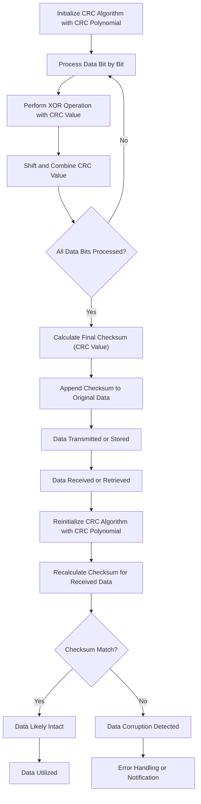

1. **Initialize CRC**:
    
    - The process begins by initializing the CRC algorithm with a specific CRC polynomial.
2. **Process Data**:
    
    - Data is processed bit by bit through the CRC algorithm.
3. **Perform XOR**:
    
    - At each step, the CRC algorithm performs an XOR operation between the current CRC value and the data bit being processed.
4. **Shift and Combine**:
    
    - After the XOR operation, the CRC algorithm shifts the CRC value and combines it with the next data bit.
5. **All Bits Processed?**:
    
    - The algorithm checks if all bits of the data have been processed.
        - If not, it loops back to the "Process Data" step to continue processing the remaining bits.
        - If yes, it proceeds to calculate the final checksum (CRC value).
6. **Calculate Checksum**:
    
    - The CRC algorithm calculates the final checksum, which is a unique value representing the processed data.
7. **Append Checksum**:
    
    - The calculated checksum (CRC value) is appended to the original data.
8. **Data Transmitted/Stored**:
    
    - The data, along with the appended checksum, is transmitted over a communication channel or stored in a storage system.
9. **Data Received/Retrieved**:
    
    - When the data is received or retrieved, the process begins again by reinitializing the CRC algorithm with the same CRC polynomial used initially.
10. **Reinitialize CRC**:
    
    - The CRC algorithm is reset with the CRC polynomial.
11. **Recalculate Checksum**:
    
    - The algorithm recalculates the checksum for the received data using the reinitialized CRC algorithm.
12. **Checksum Match?**:
    
    - The recalculated checksum is compared with the received checksum to check for data integrity.
        - If the checksums match, it indicates that the data is likely intact.
            - Data continues to be utilized or processed normally ("Data Intact").
        - If the checksums don't match, it detects data corruption.
            - Error handling or notification mechanisms are triggered ("Data Corruption Detected").

This flowchart and explanation illustrate how the CRC algorithm works to detect data corruption and ensure data integrity during data transmission or storage.