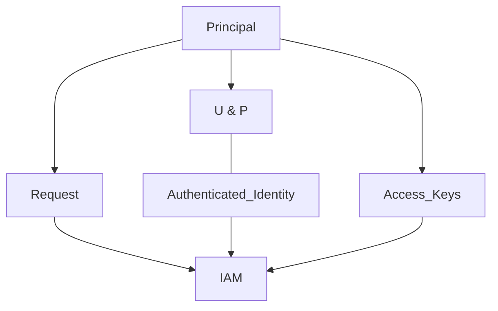

IAM Users are an identity used for anything requiring long-term AWS access e.g. Applications, Service Accounts or Human users

# Amazon Resource Name (ARN)

# Summary
- 5000 IAM users per account
- IAM User can be a member of 10 groups
- This has systems design impacts
- Internet-scale applications
- Large orgs & org merges
- IAM Roles & Identity Federation fix this (more later)

