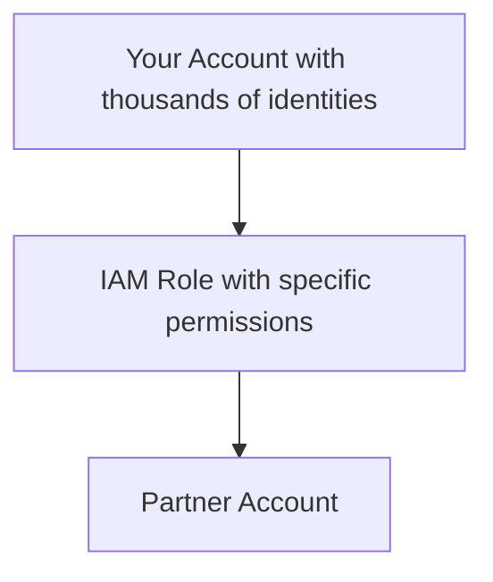

Groups are not a true identity. They can't be referenced as a principal in a policy.

# IAM Roles
IAM roles are assumed - once the role is assigned you gain the permission the roles has

IAM roles can have two types of permission policies attached to them

1. Trust policy - defines the identities which are allowed/restricted to assume the role
	- Reference identities within a single or multiple AWS accounts
	- Can refer to identities from other providers such as Facebook, Google etc
	
2. Permission policy
	- AWS Resource policies 

Note: If an identity is allowed to assume a role, AWS generates temporary security credentials for that role (access-keys). Generated by STS (Secure-Token-Service)

On expiry, the identity needs to renew them by reassuming the role.

# When to use IAM Roles

Look at the below scenario

If we didn't use the IAM role we would have to hard code the permissions for the AWS lambda, which is not only unsafe but harder to maintain as well.

**External accounts can't be used in AWS directory** 

# Web Identities
Most applications allow us to sign in / sign up based on another web identity such as Google, Facebook, Apple.

We can use these identities in our application to assume an IAM role.
- No AWS credentials on the app
- Uses existing customer logins
- Scales to 100000000's of accounts and beyond

# Service-linked roles
- IAM role linked to specific AWS service
- Predefined by a service
- Providing permissions that a service needs to interact with other AWS services on your behalf
- Service might create/delete the role
- Or allow you to during the setup or within IAM
- You can't delete the role until it's no longer required

Member accounts within the AWS Organization can utilize the nested account structure, where the root container of the organization acts as the top-level entity. Multiple organizational units can be created within the root container to organize member accounts and resources based on business units, departments, or projects. [See image below]

