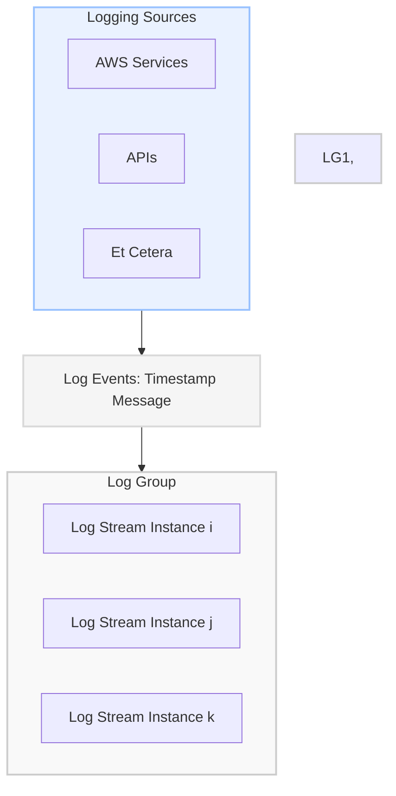

# CloudWatch
- Public service - usable from AWS or on-premises
- Store, Monitor and access logging data
- AWS Integrations - EC2, VPC Flow Logs, Lambda, CloudTrail, R53 and more
	- IAM and Service Roles provide access
- Can generate metrics based on logs - metric filter

